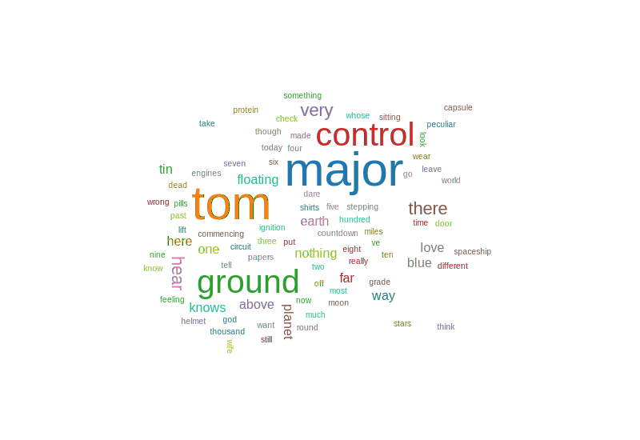
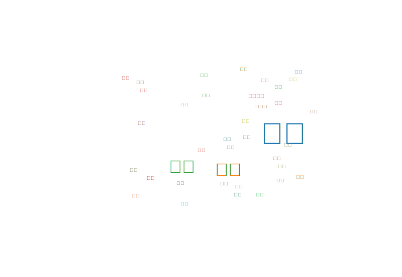

# SimpleWordCloud

A simple and lightweight word cloud generator for English and Chinese text, built with TypeScript.

## Features

- Supports both English and Chinese text
- Customizable appearance (colors, fonts, sizes, etc.)
- Works in both Node.js and browser environments
- Built with TypeScript for type safety
- Uses simple tokenization algorithms for both English and Chinese text
- Generates SVG-based word clouds using d3-cloud

## Published Package

This package is published on npm as [@harryjwang/simplewordcloud](https://www.npmjs.com/package/@harryjwang/simplewordcloud).

## Installation

```bash
npm install @harryjwang/simplewordcloud
```

## Usage

### Node.js

```typescript
import { NodeSVGGenerator } from '@harryjwang/simplewordcloud';

// Generate a word cloud from English text
const englishText = 'This is a sample English text for word cloud generation...';
const svgString = NodeSVGGenerator.generateSVG(englishText, 'english', 800, 600, 100);

// Generate a word cloud from Chinese text
const chineseText = '这是一个用于生成词云的中文示例文本...';
const svgString2 = NodeSVGGenerator.generateSVG(chineseText, 'chinese', 800, 600, 100);

// Save the SVG to a file
const fs = require('fs');
fs.writeFileSync('wordcloud.svg', svgString);
```

### Browser

```html
<!-- Include the SimpleWordCloud library -->
<!-- Option 1: From node_modules -->
<script src="node_modules/@harryjwang/simplewordcloud/dist/browser/simplewordcloud.min.js"></script>

<!-- Option 2: From CDN (recommended for production) -->
<script src="https://cdn.jsdelivr.net/npm/@harryjwang/simplewordcloud/dist/browser/simplewordcloud.min.js"></script>

<div id="wordcloud-container"></div>

<script>
  // Generate a word cloud
  const text = 'This is a sample text for word cloud generation...';
  const container = document.getElementById('wordcloud-container');
  
  // Generate the word cloud with custom options
  SimpleWordCloud.generateWordCloud(text, 'english', container, {
    width: 800,
    height: 600,
    maxWords: 100,
    fontFamily: 'Arial, sans-serif',
    minFontSize: 10,
    maxFontSize: 60
  });
</script>
```

## API

### `NodeSVGGenerator`

A utility class for generating word clouds in Node.js environments.

#### Methods

- `generateSVG(text: string, language: Language, width?: number, height?: number, maxWords?: number): string` - Generate a word cloud as an SVG string

### `WordCloud`

The main class for generating word clouds in browser environments.

#### Constructor

```typescript
new WordCloud(options?: WordCloudOptions)
```

#### Methods

- `generate(text: string, language: Language): SVGElement | string` - Generate a word cloud as an SVG element (browser) or string (Node.js)
- `generateSVG(text: string, language: Language): string` - Generate a word cloud as an SVG string

### `WordCloudOptions`

Options for customizing the word cloud appearance.

```typescript
interface WordCloudOptions {
  width?: number;            // Width of the word cloud (default: 800)
  height?: number;           // Height of the word cloud (default: 600)
  fontFamily?: string;       // Font family (default: 'Arial, sans-serif')
  maxWords?: number;         // Maximum number of words (default: 100)
  colors?: string[];         // Color scheme (default: d3.schemeCategory10)
  padding?: number;          // Padding between words (default: 5)
  minFontSize?: number;      // Minimum font size (default: 10)
  maxFontSize?: number;      // Maximum font size (default: 60)
  rotationAngles?: number[]; // Rotation angles in degrees (default: [0, 90])
  rotationProbability?: number; // Probability of rotation (default: 0.3)
}
```

### `Language`

Supported languages for tokenization.

```typescript
type Language = 'english' | 'chinese';
```

## Demo

To run the demo locally:

1. Clone this repository
2. Install dependencies: `npm install`
3. Build the package: `npm run build:all`
4. Start the demo server: `node server.js`
5. Open `http://localhost:3000/demo/index.html` in your browser

Alternatively, you can run the Node.js test script:

```bash
node test/node-test.js
```

This will generate two SVG files in the test directory: `english-wordcloud.svg` and `chinese-wordcloud.svg`.

### Sample Word Clouds

Here are examples of the word clouds generated by the package:

#### English Word Cloud



#### Chinese Word Cloud



The test script uses d3-cloud with node-canvas to generate word clouds that look identical to those produced in the browser.

## Browser Compatibility

The package is designed to work in modern browsers. The browser version uses a simplified tokenization approach to avoid dependencies on Node.js-specific modules.

## Development

### Building

```bash
# Build the Node.js version
npm run build

# Build the browser version
npm run build:browser

# Build both versions
npm run build:all
```

### Testing

The package includes a test script that demonstrates how to use the library in a Node.js environment. The test script uses `d3-cloud` with `node-canvas` to generate word clouds that look identical to those produced in the browser.

```bash
# Install the canvas dependency for testing
npm install canvas --save-dev

# Run the test script
node test/node-test.js
```

The test script will generate two SVG files in the test directory: one for English text and one for Chinese text.

## License

MIT